# Argon-Xboard

基于 [Argon Design System](https://demos.creative-tim.com/argon-dashboard) 视觉语言开发的 **Xboard 用户端主题**。采用现代渐变、圆角卡片与清晰的信息层级，不绑定固定域名，可部署在根域名或任意子域名。

> An Xboard front-end theme developed in Argon style, featuring modern gradients, rounded cards and a clean hierarchy. No domain binding required.

## 界面预览（全部页面）

| 登录页（中文） | 登录页（英文） | 注册页 |
| --- | --- | --- |
| 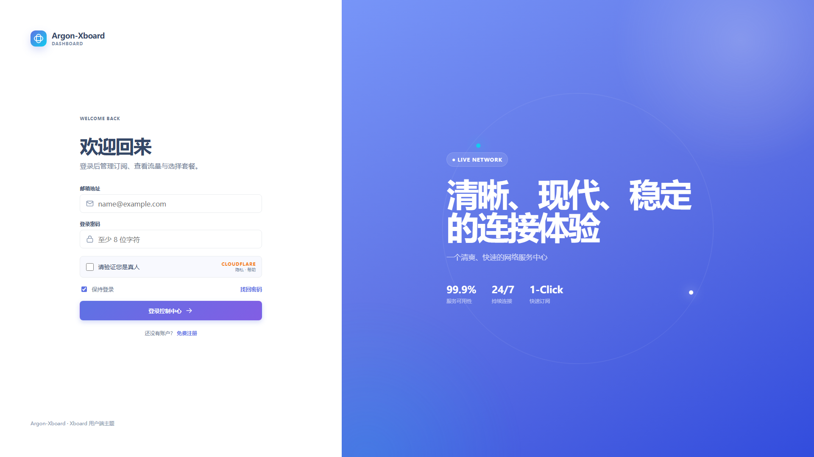 | 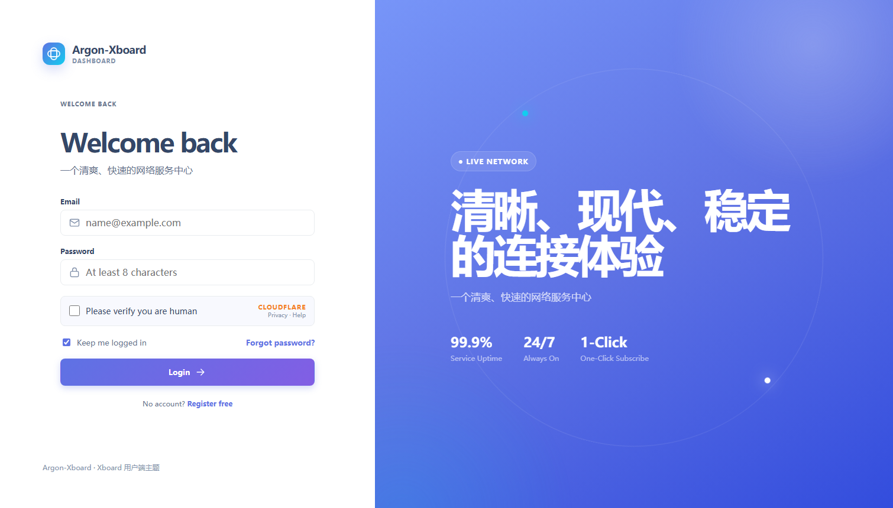 | 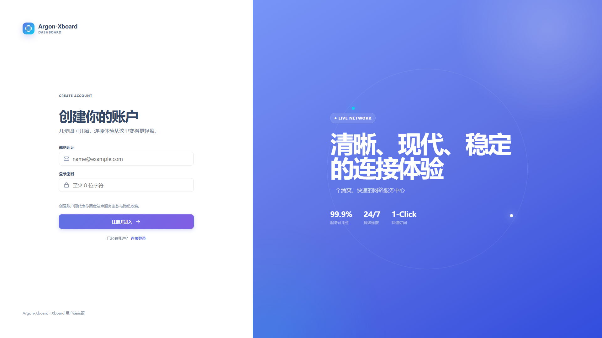 |

| 找回密码 | 仪表盘（中文） | 仪表盘（英文） |
| --- | --- | --- |
| 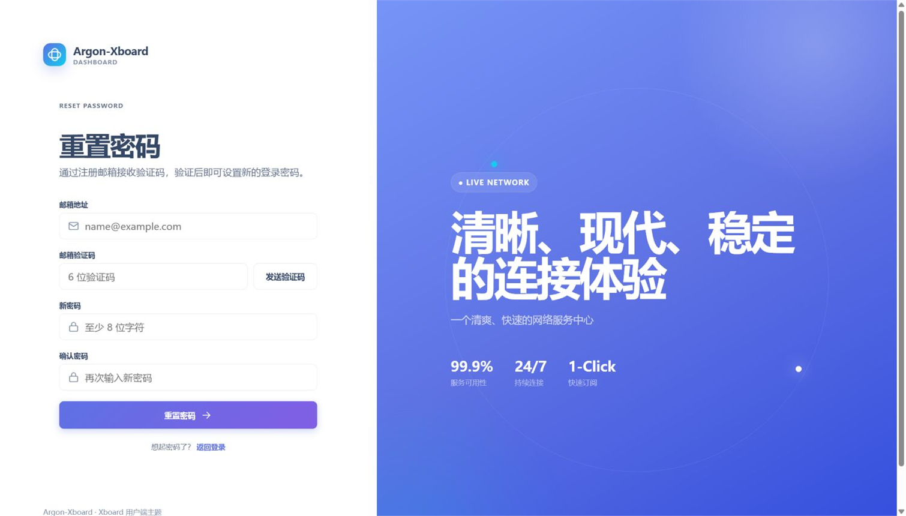 | 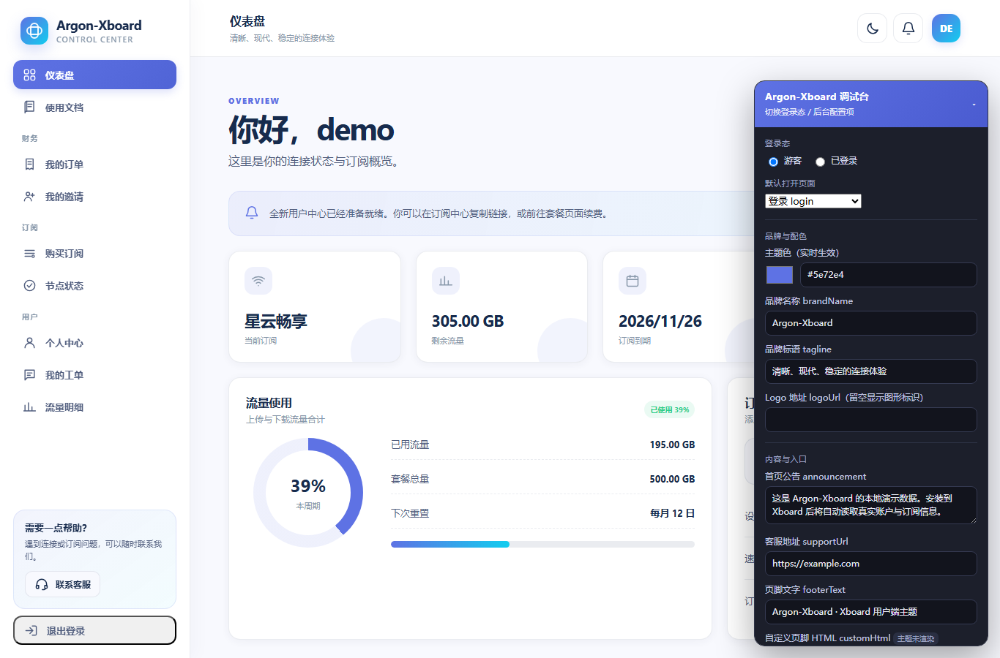 | 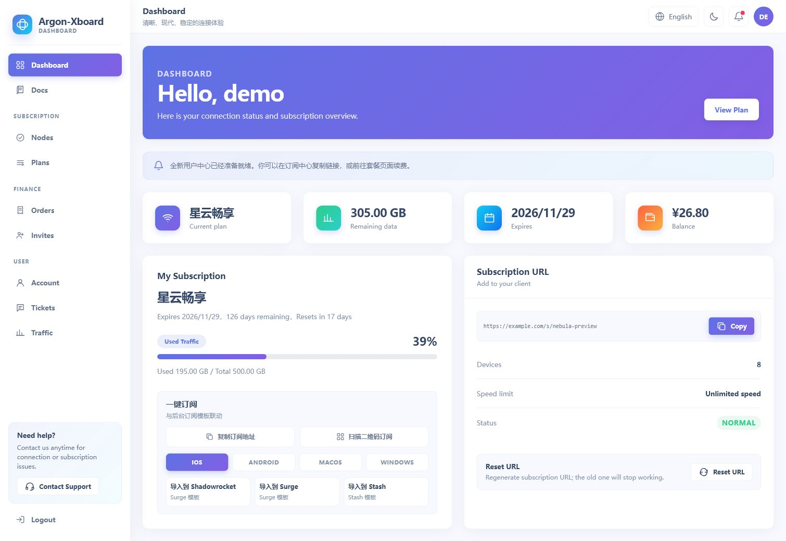 |

| 使用文档 | 购买订阅 | 我的订单 |
| --- | --- | --- |
| 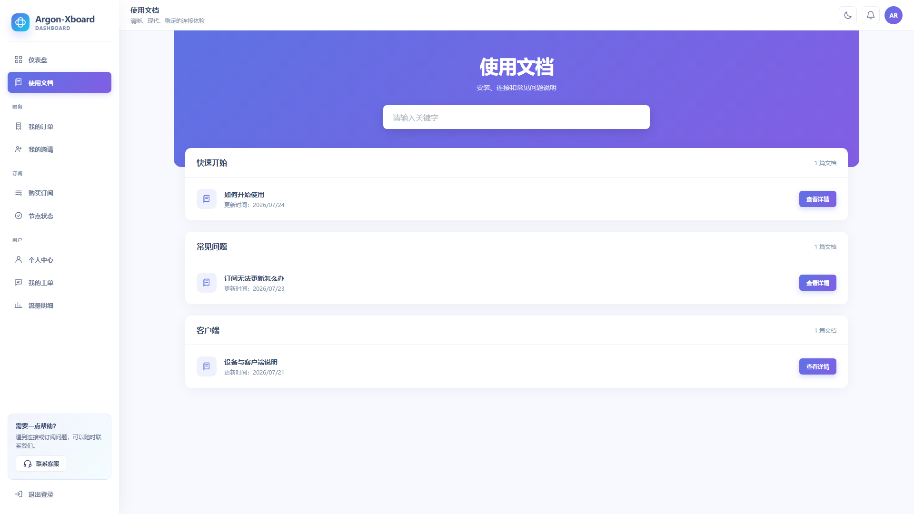 | 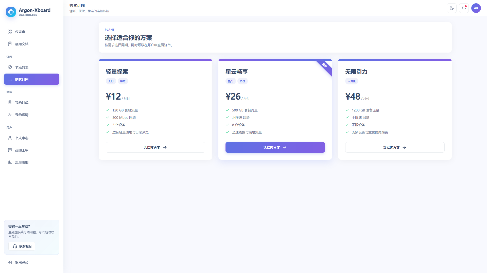 | 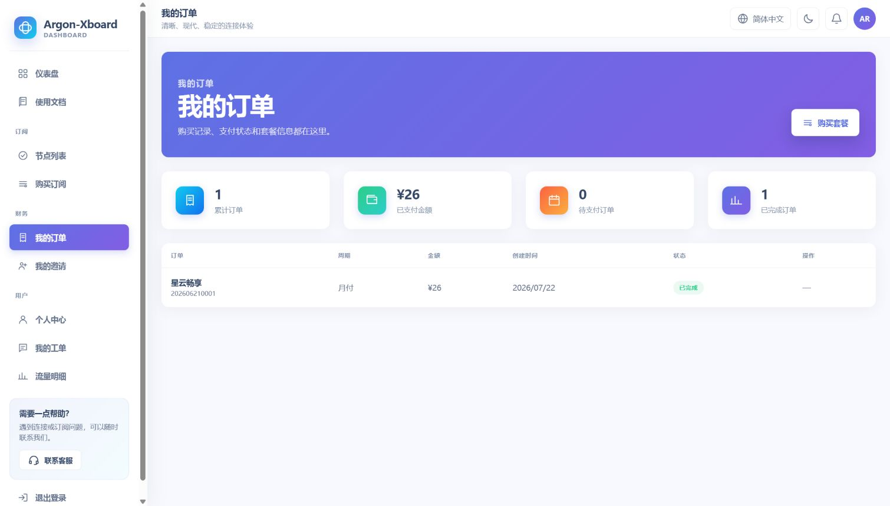 |

| 我的邀请 | 节点列表 | 我的工单 |
| --- | --- | --- |
| 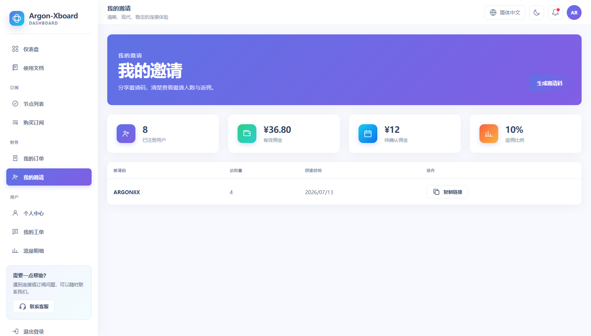 | 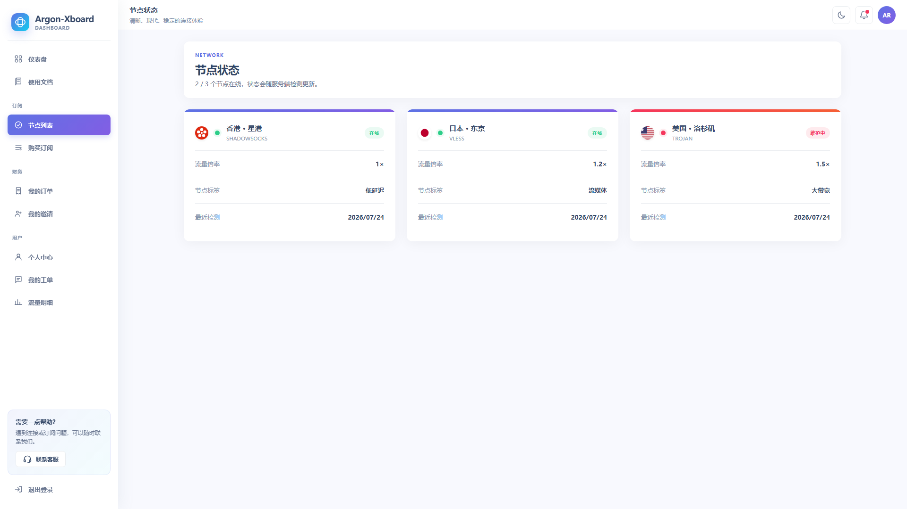 | 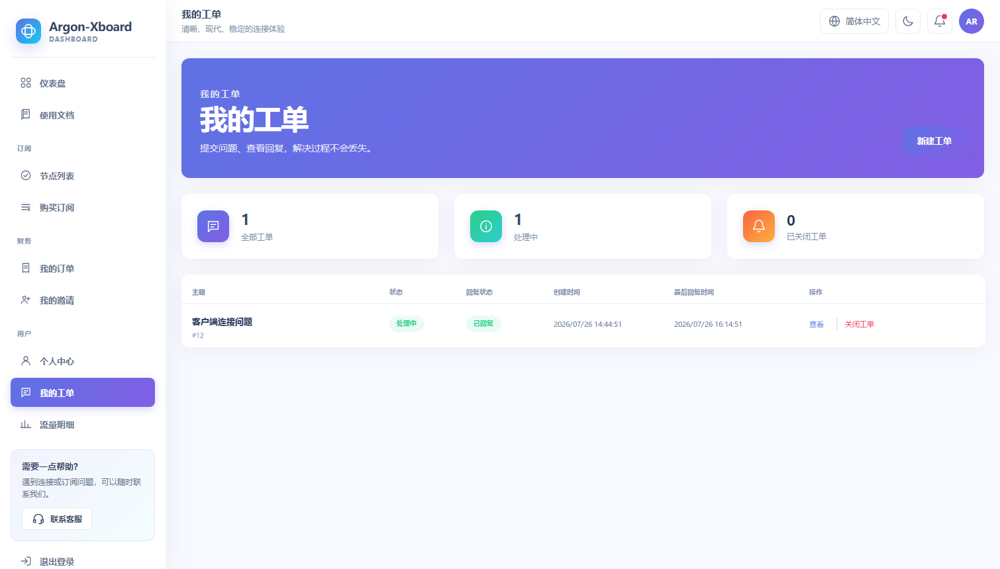 |

| 流量明细 | 个人中心（中文） | 个人中心（英文） |
| --- | --- | --- |
| 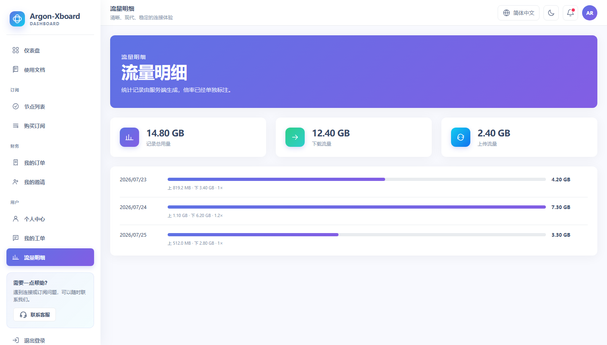 | 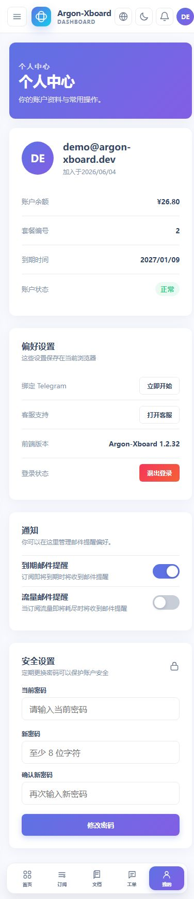 | 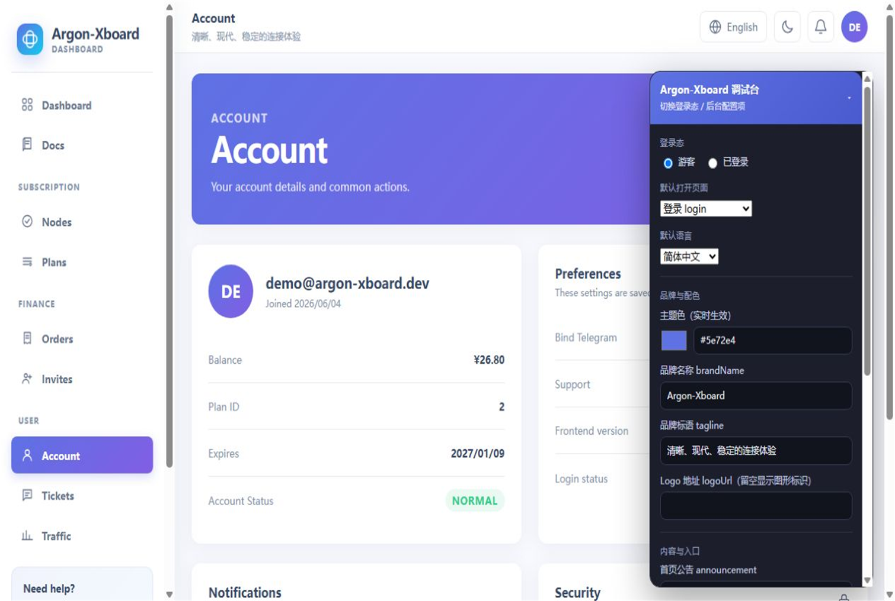 |

## 特性

- 登录、注册、邮箱验证码及验证适配
- 用户仪表盘、「我的订阅」卡片（套餐 / 到期倒计时 / 重置倒计时 / 流量进度）
- 使用文档（渐变头部 + 关键字搜索 + 分类卡片 + 查看详情侧栏）
- 订阅链接一键复制与一键重置（调用 `/api/v1/user/resetSecurity`）
- 套餐选择（渐变卡片 + 推荐标签）、创建订单与基础支付跳转
- 订单列表（统计卡 + 表格）、取消待支付订单
- 邀请码与返佣统计
- 节点状态（彩色顶部条区分在线 / 维护）
- 工单列表（统计卡 + 新回复状态）、工单创建和回复
- 流量明细（每日用量条形图）
- 个人中心（修改密码）、客服入口、深 / 浅色模式
- 顶部铃铛：有处理中 / 新回复工单时显示红点，点击直达工单页
- 桌面端与移动端响应式布局
- API 始终使用同源 `/api/v1`，不绑定固定域名
- 内置演示模式（`preview.html`），无需后端即可查看界面与交互

## 目录结构

```text
Argon-Xboard/
├─ config.json          # 主题元信息与后台可配置项
├─ dashboard.blade.php  # Xboard 入口模板（注入品牌配置）
├─ preview.html         # 本地演示调试台（含模拟数据）
├─ assets/
│  ├─ theme.css         # Argon 风格样式
│  └─ theme.js          # 主题逻辑 + 同源 API 调用 + 演示 mock
└─ screenshots/         # 预览截图
```

## 安装到 Xboard

1. 下载安装包 [`Argon-Xboard-1.2.10.zip`](https://github.com/panhuanghe/Argon-Xboard/releases/download/v1.2.10/Argon-Xboard-1.2.10.zip)。
2. 进入 Xboard 管理后台的「主题」页面，上传该 ZIP。
3. 切换到 **Argon-Xboard**，按需填写品牌名称、主题色与客服地址。

> 安装包内部结构为 `Argon-Xboard/...`，符合 Xboard 的主题上传规则。直接把仓库内容按 `Argon-Xboard/` 目录打包同样可用。

## 本地预览

仓库内含 `preview.html`，用浏览器直接打开即可查看模拟数据（无需后端）：

- 右下角调试台可切换「游客 / 已登录」登录态、默认打开的页面、主题色、品牌名称与页脚。
- 也支持 URL 参数临时覆盖，例如：

  ```text
  preview.html?state=user&route=dashboard&color=%235e72e4
  ```

主题在 `preview.html` 下会自动进入演示模式，由 `theme.js` 内置的 `mockApi` 返回模拟数据；部署到 Xboard 后将自动改为读取真实接口。

## 后台配置项

配置项在 Xboard 主题设置中填写，对应 `config.json` 的字段：

| 字段 | 说明 | 默认值 |
| --- | --- | --- |
| `brand_name` | 品牌名称 | `Argon-Xboard` |
| `tagline` | 品牌标语（登录页 / 仪表盘顶部） | 清晰、现代、稳定的连接体验 |
| `primary_color` | 主题色（十六进制） | `#5e72e4` |
| `logo_url` | Logo 地址（留空显示图形标识） | 空 |
| `announcement` | 首页公告（留空用后台公告） | 空 |
| `support_url` | 客服地址 | 空 |
| `footer_text` | 页脚文字 | `Powered by Argon-Xboard · Xboard` |
| `custom_html` | 自定义页脚 HTML | 空 |

## 自定义与二次开发

- 主题色、品牌、Logo、公告、客服与页脚均在后台主题配置中填写，无需改代码。
- 想要更深改造，直接修改 `assets/theme.css` 与 `assets/theme.js`：
  - `theme.css` 顶部定义了 CSS 变量（`--primary`、`--primary-strong`、`--surface-soft`、`--ink` 等），改这里即可整体换肤。
  - `theme.js` 是一次性 IIFE，加载时读取 `window.XBOARD_THEME`；所有接口走同源 `/api/v1`，Xboard 后端原生兼容，无需修改 API 路径。
- 无构建步骤、无域名绑定，构建产物可直接放到 `theme/Argon-Xboard/`。

## 技术说明

- 纯前端：Blade 模板 + 原生 CSS/JS，无框架依赖、无打包步骤。
- 数据来自 Xboard 同源接口 `/api/v1`，主题只负责渲染，套餐字段由后端 `plan/fetch` 提供（`theme.js` 内的周期标签映射与渲染函数负责展示）。
- 演示模式仅用于本地预览，部署后自动失效。

## 许可证

本主题以 Argon 风格实现，采用 MIT 许可。
